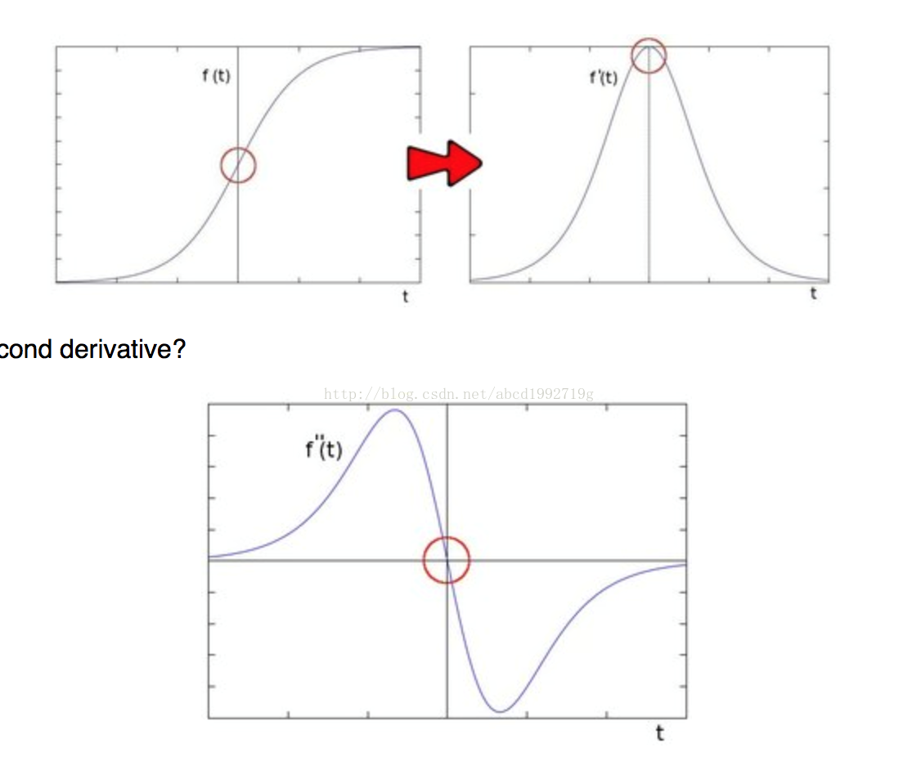
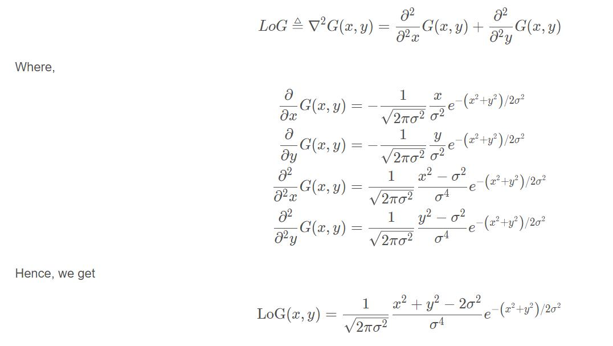
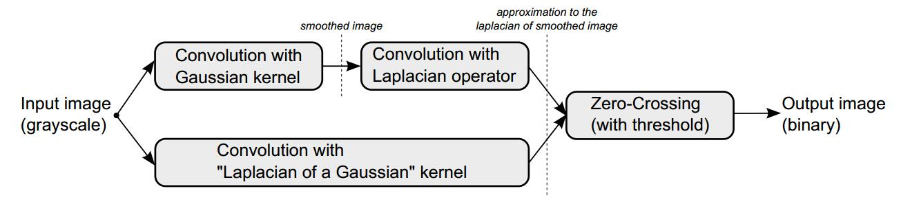
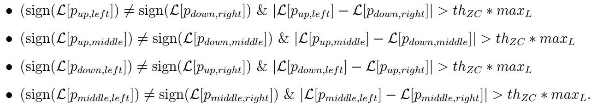
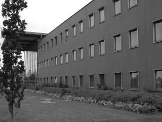
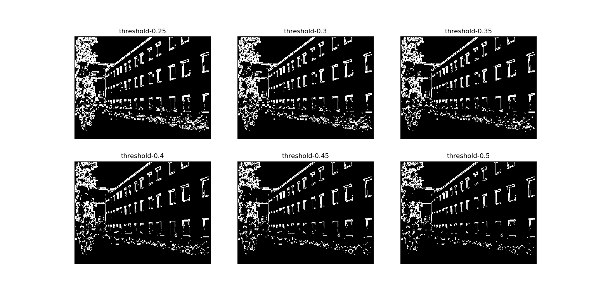
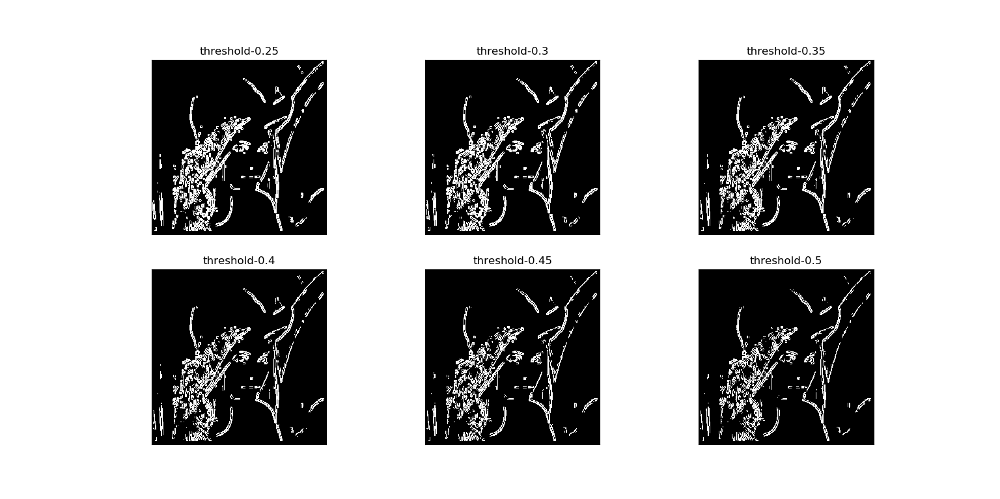
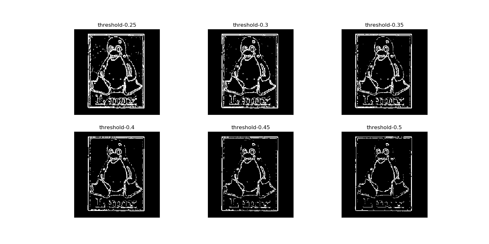

## Introduction
In 1980 Marr and Hildreth [1] argued that intensity changes are not independent of image scale, so
edge detection requires the use of different size operators. They also argued that a sudden intensity
change will be seen as a peak (or valley) in the first derivative or, equivalently, as a zero crossing in the
second derivative. The below image is an intuitive explanation.


## Mathematical derivation  
In this algorithm, the Laplacian of Gaussian(LoG) operator was proposed. It is a combined filter which has the same effects with Gaussian smoothing first and then calculating the 2-nd derivative using Laplacian operator.


And we can get the LoG operator easily. Here is the image of a LoG kernel with \sigma=4 and n=31.

## Block diagram and pseudo-code
The following image shows the overall processing of the algorithm. As mentioned above, using LoG operator directly is equal to Gaussian plus Laplacian. You can choose either way you want. 


Here is the pseudo-code. 
```python
Algorithm: Marr-Hildreth edge detection algorithm.
Require: im input image, standard deviation σ, kernel size n and zero-crossing threshold th_ZC.

log kernel ← generate log kernel(n,σ)
imlap ← convolution(im,log kernel)

maxL ← 0
for all pixel i in image imlap do
    if imlap[i] > maxL then
    maxL ← imlap[i]
    end if
end for

for all pixel i in image imlap, except borders do
    for all pair (p1, p2) of opposite neighbors of p in imlap do
        if (sign(imlap[p1]) ≠ sign(imlap[p2])) and (|imlap[p1] − imlap[p2]| > th_ZC) then
            edges[i] ← 1
        else
            edges[i] ← 0
        end if
    end for
end for

return edges
```
Notice that:
- the neighbor pixel is based on 8-way connection, and we use them as 4 opposite-pair cases as following:

- the threshold we feed into the code is defined as a percentage of the maximum value of the gradient
image.

## Usage
please read the code in `Marr_Hildreth_algorithm.py` and modify some parameters.
## My Result
I set the parameters as follows, sigma=1,size=5,threshold=0.4.

Input:



Output:


Input:


Output:



Input:


Output:




## References
[1] D. Marr; E. C. Hildreth., Theory of edge detection, Proceedings of the Royal Society,
London B, 207 (1980), pp. 187–217
[2] H. Sponton; J. Cardelino, A Review of Classic Edge Detectors,2015