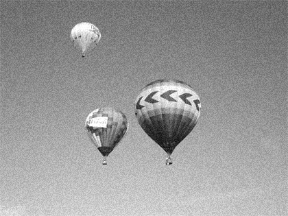
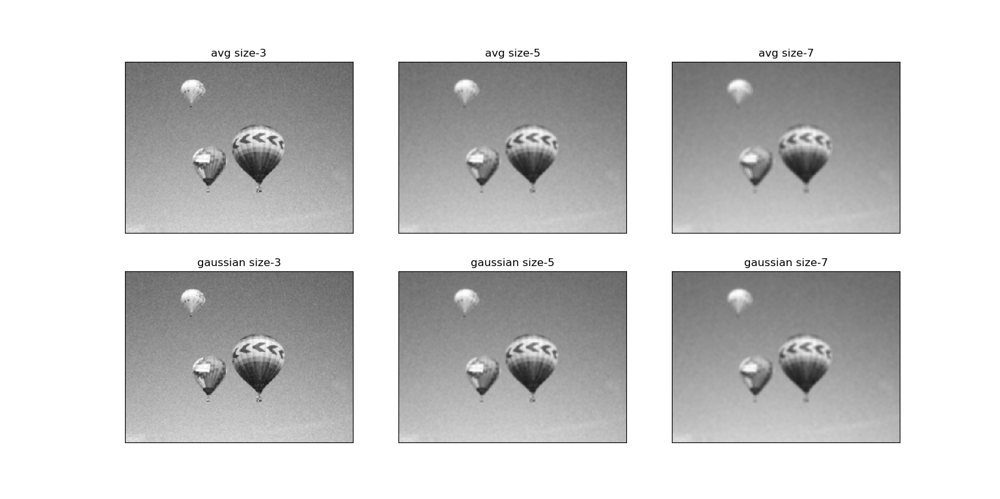
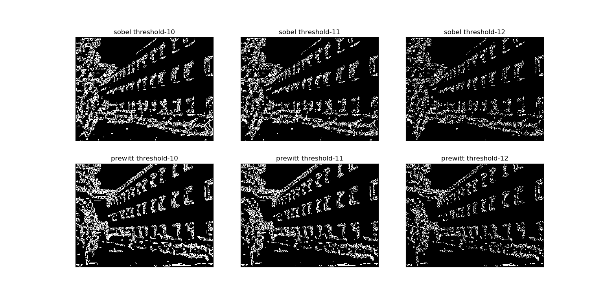

## Overview
This PA include two tasks:
- The first is to implement convolution operation under different types of kernels and compare their outputs.
- The second is to implement edge detection algorithm based on `Sobel` and `Prewitt` operators.
These two approaches are based on first derivative of the source image. Later in 80's, some other approaches were introduced based on second derivative of the images.Marr-Hildreth algorithm is a typical one. And I've implemented this algorithm, you can check it out :point_right:[>>here<<](./Marr-Hildreth-intro.md).:point_left:

You can check the manual `CAP5415_2012_PA1.pdf` for detail.

## My result
For the first task, I wrote the code to generate different size of Gaussian kernels and Average kernels, which are some basic smoothing kernels using in image de-blurring.
And I used the `cv2.filter2D()` to complete the convolution operation.

Here is the result:

Input


 
Output


For the second task, I implemented the edge detection algorithm as per following steps:
```python
        0. generate the operator
	1. noise removing (using gaussian smoothing)
	2. compute horizontal and vertical gradients
	3. magnitude the gradients
	4. apply a threshold
```

And I got my best result under the following parameters:
 gaussian size--(11 x 11), threshold--11, operator--Prewitt, here is my result:

Input 


 
Output


 
 You can modify the configuration in `line 133` of `PA1.py` and feed in you own input.
 
## Usage
```python
python PA1.py
```
You can check the code for detail handling and they are well self-explanatory. :-)