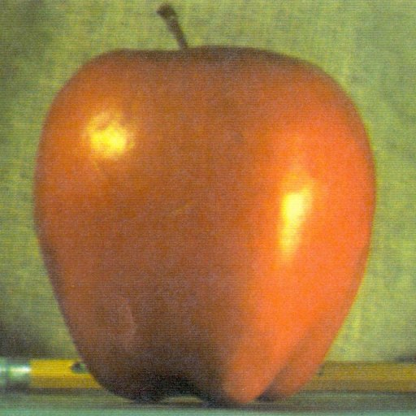

## Overview
Here includes some of my experiments and implementation of some technics during lecture 4 to lecture 7, they are:

- :heavy_check_mark: Harris Corner Detector algorithm from scratch using python and OpenCV.
- :heavy_check_mark: Using Gaussian and Laplacian pyramids to blending images.
- :pushpin: SIFT implementation (still updating ...  )
## Usage

- Usage of Harris Corner Detector
```
$ python corner.py <your_img_path> 

Sample: $ python corner.py ./img/chessboard.jpg
```
Slide the trackBar, when the result is good enough, just knock down the space, the result will be saved automatically in the `result` directory.


- Usage of pyramid blending
```
$ python pyramid.py [imgA_path] [imgB_path] [layer]
```
By default, I've configured the `imgA_path`,`imgB_path`,`layer` as `./img/apple.jpg`, `./img/orange.jpg`, `6` respectively. Notice that the two images must be consistent with their shape (i.e. width,height,channel) 

## My Result

- Result of Harris Corner Detector

Input:


Output(with threshold as 68):


- Result of pyramid blending

Input:




Output:

Direct Blending


Pyramid Blending (with layer as 6)


By increasing the layer parameter, you will find some noise in the generated picture. 


